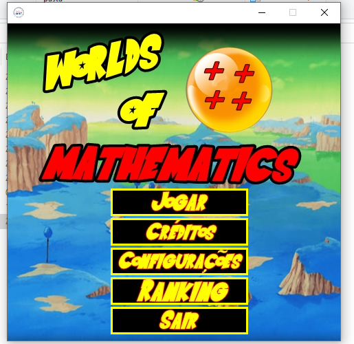
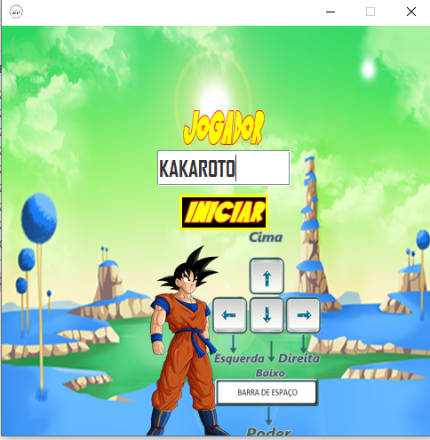
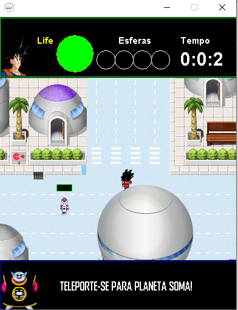
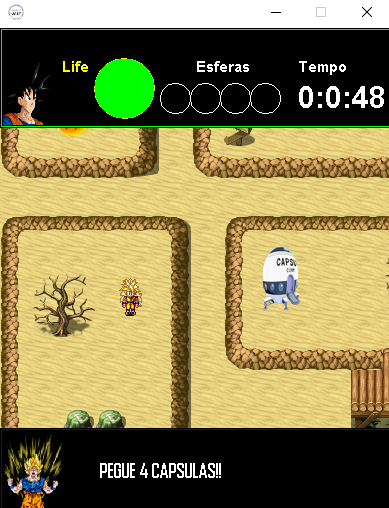

# Mundos da Matemática 🕹️

Mundos da Matemática é um jogo desenvolvido pelo discente Paulo Alves da Silva, sob orientação do Prof. Dr. Richarlyson Alves D'Emery, durante a disciplina de MPOO, do curso de Bacharelando em Sistemas de Informação da Unidade Acadêmica de Serra Talhada (UAST) da Universidade Federal Rural de Pernambuco (UFRPE). 
O jogo tem como objetivo exercitar de maneira lúdica conceitos de amatemática como soma, subtração, multiplicação e divisão.

- Acesse o jogo através do link: [(https://github.com/pauloAlves98/br.edu.mundosdamatematica/releases/tag/v.1.0)]
- Após o download extraia o arquivo e execute o .jar

## Autores 👨‍💻👨‍🏫

- Paulo Alves da Silva
- Prof. Dr. Richarlyson Alves D'Emery

## Ano 📅

2018

## Descrição do jogo 🎮

O jogo se passa em cenários baseados no anime de Dragon Ball Z. O personagem principal pecorre mundos em busca das esferas da matemática. Ao derrotar ou se desviar dos inimigos de cada cenário, ele é premiado com a esfera equivalente a operação matemática daquele mundo.

### Capturas de tela 📸

#### Home Page

#### Nome

#### Cenário

#### Fase

## Tecnologias Utilizadas

-  Java

## Universidade 🎓

Unidade Acadêmica de Serra Talhada/Universidade Federal Rural de Pernambuco (UAST-UFRPE)

